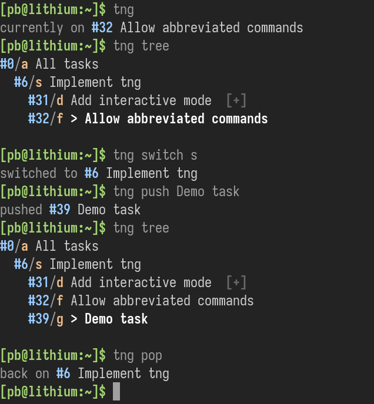

# tng - the next-generation task manager

`tng` is an evolution of [tasks](https://github.com/pb-/tasks) with strong inspiration from [frame](https://github.com/lelanthran/frame).




## Installation

[Babashka](https://babashka.org/) is required on your system to run `tng`. Otherwise simply download [`tng`](https://raw.githubusercontent.com/pb-/tng/master/tng) and make it executable:

```shell
$ curl https://raw.githubusercontent.com/pb-/tng/master/tng > tng
$ chmod a+x tng
```


## Usage

### `status`/no command - show the current task
```shell
$ tng status
currently on #32 Allow abbreviated commands

# Or simply
$ tng
currently on #32 Allow abbreviated commands
```


### `push` - create a sub task and switch to it

```shell
$ tng push Buy milk
pushed #38 Buy Milk

# Or launch an $EDITOR (task descriptions can be multi line)
$ tng push
# ... editing ...
pushed #38 Buy Milk
```


### `pop` - pop the current task

```shell
$ tng pop
back on #32 Allow abbreviated commands
```


### `edit` - edit the current task

```shell
# Will use $EDITOR
$ tng edit
# ... editing ...
edited #32 Allow abbreviated commands
```


### `stack` - show the current task stack

```shell
$ tng stack
#0/a All tasks
  #6/s Implement tng
    #32/f > Allow abbreviated commands
```


### `create` - create a sub task but don't switch to it

```shell
$ tng create Buy milk
created #38 Buy Milk
```


### `tree` - show the entire task tree

```shell
$ tng tree
#0/a All tasks
  #6/s Implement tng
    #31/d Add interactive mode  [+]
    #32/f > Allow abbreviated commands
```


### `list` - show the current task and sub tasks

```shell
$ tng list
#6/s > Implement tng
  #31/d Add interactive mode  [+]
  #32/f Allow abbreviated commands
```


### `switch` - switch the current task

```shell
# You can either use the immutable task number
$ tng switch 32
switched to #32 Allow abbreviated commands

# Or the task label (mutable; printed with tree/list/stack)
$ tng switch f
switched to #32 Allow abbreviated commands
```
